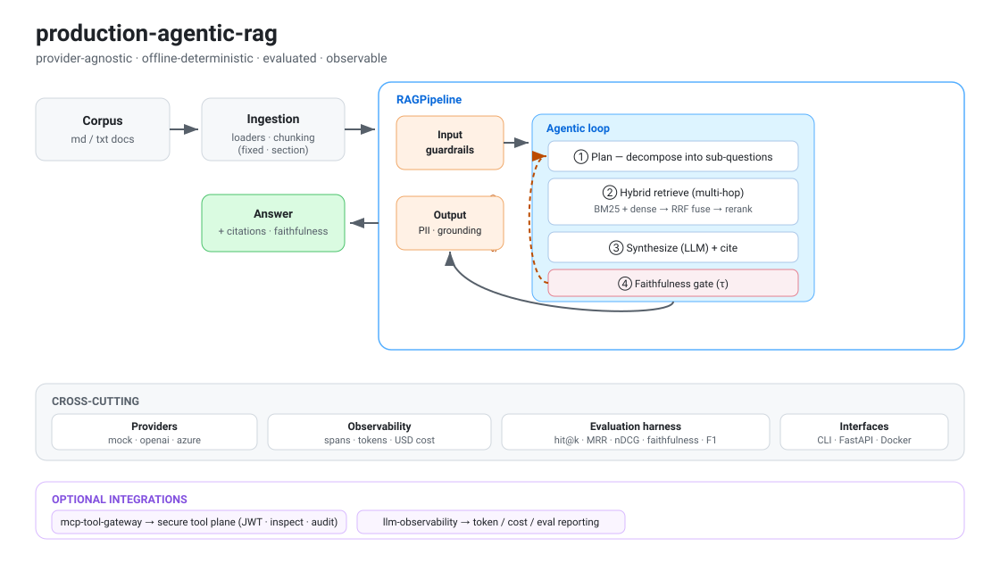

# 🤖 production-agentic-rag

A **provider-agnostic, production-grade agentic RAG system** — ingestion, hybrid
retrieval, a self-correcting multi-hop agent, guardrails, a real evaluation harness,
and built-in observability. The **core has zero runtime dependencies and runs fully
offline** (deterministic mock LLM + hashing embeddings), so the whole pipeline —
including its faithfulness gate and eval metrics — is CI-testable without API keys.
Swap one setting to run on **OpenAI or Azure OpenAI**.

[](https://github.com/chandanCoding/production-agentic-rag/actions)

<p align="center">
  
</p>

## Why this exists
Most RAG demos stop at "embed → top-k → prompt." Production systems need **planning,
multi-hop retrieval, grounding checks, guardrails, evaluation, and observability**.
This project implements those concerns as clean, swappable components.

## Architecture

```
                         ┌──────────────────────────── RAGPipeline ────────────────────────────┐
  corpus ──▶ ingest ──▶  │  input guardrails ─▶ AgenticRAG ─▶ output guardrails (PII, grounding) │ ──▶ answer + citations
 (loaders,  (chunking)   │                         │                                             │
  md/txt)                │        ┌────────────────┴───────────────┐                            │
                         │        │  plan → for each sub-q:         │  ◀── self-correct if       │
                         │        │     hybrid retrieve (BM25+dense │      faithfulness < τ      │
                         │        │     → RRF fuse → rerank)        │                            │
                         │        │  → synthesize (LLM) → score     │                            │
                         │        └─────────────────────────────────┘                            │
                         │  cross-cutting:  providers (mock|openai|azure)  ·  Tracer (spans, tokens, cost) │
                         └──────────────────────────────────────────────────────────────────────┘
                                                   │
                                        evaluation harness
                              (hit@k · MRR · recall@k · nDCG · faithfulness · answer-F1)
```

See [`docs/ARCHITECTURE.md`](docs/ARCHITECTURE.md) for the full design.

## Features
- **Ingestion** — file/dir loaders; fixed-size (overlap) and markdown-section chunkers.
- **Hybrid retrieval** — BM25 (from scratch) + dense vectors, **Reciprocal Rank Fusion**, stopword-aware reranking, embedding cache.
- **Agentic loop** — query **planning/decomposition**, **multi-hop** retrieval, grounded synthesis with **citations**, and **faithfulness-gated self-correction**.
- **Guardrails** — prompt-injection input blocking, output PII redaction, grounding score.
- **Evaluation** — labelled-dataset harness: hit@k, MRR, recall@k, nDCG, faithfulness, answer token-F1.
- **Observability** — hierarchical trace spans, token + USD cost accounting, latency.
- **Interfaces** — `prag` CLI (`ask`, `eval`), FastAPI service (`/ask`, `/health`), Docker, CI matrix.
- **Provider-agnostic** — `mock` (offline) ↔ `openai` ↔ `azure` via config/env.
- **Pluggable engine** — the same plan→retrieve→generate→self-correct flow runs on the built-in agent **or a real LangGraph `StateGraph`** (`RAG_ENGINE=langgraph`).

## Quickstart (offline, no keys)

```bash
pip install -e ".[dev]"          # or just: PYTHONPATH=src ...
python examples/quickstart.py

# CLI
prag ask "what is the return window and how long do refunds take?"
prag eval --k 3                  # runs the evaluation harness over data/eval/qa.jsonl
```

Example `ask` output (offline):
```json
{
  "answer": "Customers may return any unused item within 30 days ... Approved refunds are issued ... within 5 business days ...",
  "citations": ["handbook:0", "handbook:3"],
  "faithfulness": 1.0,
  "iterations": 1,
  "trace": {"spans": 6, "input_tokens": 69, "output_tokens": 43, "cost_usd": 0.0}
}
```

## Run on a real model
```bash
export RAG_LLM_PROVIDER=azure RAG_EMBED_PROVIDER=openai
export AZURE_OPENAI_ENDPOINT=... AZURE_OPENAI_API_KEY=...
prag ask "..."
```
(see `.env.example` for all settings)

## Engines (built-in vs LangGraph)
The agentic flow runs on either engine — same nodes, same self-correction loop:

```bash
pip install ".[langgraph]"
RAG_ENGINE=langgraph prag ask "what is the return window and how long do refunds take?"
# or: prag ask "..." --engine langgraph
```
The LangGraph engine compiles a `StateGraph` (`plan → retrieve → generate` with a
conditional edge back through `reformulate` when faithfulness < threshold). If
LangGraph isn't installed, the pipeline falls back to the built-in agent automatically.

## Serve it
```bash
pip install -e ".[api]"
uvicorn api.main:app --reload     # POST /ask  ·  GET /health  ·  /docs
# or:
docker build -t production-agentic-rag . && docker run -p 8000:8000 production-agentic-rag
```

## Optional integrations
Two sibling libraries plug in when installed (graceful fallback otherwise):

```bash
pip install ".[gateway]"        # secure every tool call via mcp-tool-gateway
pip install ".[observability]"  # export token/cost/eval via llm-observability
```
```python
from production_agentic_rag.integrations import SecuredRetrievalTool, export_observability
pipeline.agent.tool = SecuredRetrievalTool(pipeline.retriever)   # JWT + injection inspection + audit
# now retrieval calls are authorized, inspected, and audited — even in-process
```
See `examples/with_integrations.py`. Without these packages the core behaves identically.

## Tests
```bash
PYTHONPATH=src pytest -q          # 20 tests, fully offline
```

## Results (sample evaluation)
Running the bundled harness (`prag eval`) over the sample corpus + 5-question
labelled set, with the **offline deterministic engine** (no API keys):

| Metric | Score |
|--------|-------|
| Retrieval hit@3 | 1.00 |
| MRR | 1.00 |
| Recall@3 | 1.00 |
| nDCG@3 | 1.00 |
| Faithfulness (mean) | 1.00 |
| Answer token-F1 vs reference | 0.37 |

> These numbers are on a small, clean sample with the extractive mock generator —
> they validate the **pipeline and metrics**, not model quality. The lower answer-F1
> reflects the mock returning whole grounded sentences vs. terse reference answers;
> with a real LLM, expect higher answer-F1 and lower-but-realistic faithfulness.
> Point `RAG_LLM_PROVIDER=azure` at your own corpus to get production-representative numbers.

## Project layout
```
production-agentic-rag/
├── src/production_agentic_rag/
│   ├── providers/      # LLM + embedding abstractions (mock / openai / azure)
│   ├── ingestion/      # loaders + chunking
│   ├── retrieval/      # bm25, vector store, hybrid (RRF + rerank)
│   ├── agents/         # planner, tools, agentic RAG loop
│   ├── evaluation/     # metrics + harness
│   ├── guardrails.py · observability.py · pipeline.py · config.py · cli.py
├── api/main.py         # FastAPI service
├── data/               # sample corpus + eval dataset
├── tests/ · examples/ · docs/
└── Dockerfile · Makefile · .github/workflows/ci.yml
```

## Limitations & roadmap
Being explicit about the boundaries — this is a reference implementation, not a hosted product:

- **Local in-memory index.** The vector store is in-process; for scale, swap `VectorStore`
  for a persistent backend (pgvector / Azure AI Search / FAISS) behind the same interface.
- **Offline embeddings are lexical-ish.** `HashingEmbedder` is deterministic for tests/CI;
  real semantic recall needs `OpenAIEmbedder` (or another dense model).
- **Heuristic planner & reranker.** Query decomposition and reranking are rule-based by
  default; the interfaces are LLM-ready (or cross-encoder-ready) drop-ins.
- **Eval set is illustrative.** The bundled 5-question set proves the harness; real
  evaluation needs a domain golden set and human-rated faithfulness.
- **No streaming / multi-tenant auth yet.** The FastAPI service is single-tenant and
  returns whole responses.

**Roadmap:** persistent vector backend · cross-encoder reranker · streaming responses ·
LLM-as-judge eval · per-tenant auth on the API · caching of full RAG responses.

## Tech
Python 3.10+ · stdlib-only core · optional: `openai`, `fastapi`, `langgraph`, `pytest` · Docker · GitHub Actions

## License
MIT — see [LICENSE](LICENSE).
